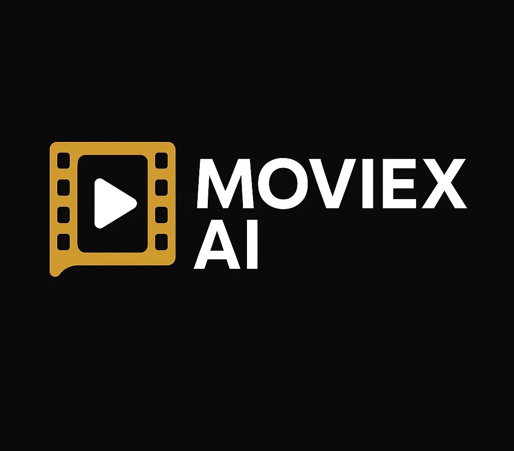

# Moviex AI

  

## 🚀 Proje Genel Bakışı

Bu proje, film verileri üzerinde kapsamlı bir analiz yaparak ve makine öğrenimi modelleri kullanarak akıllı bir film öneri sistemi geliştirmeyi amaçlamaktadır. Kullanıcıların beğenilerine ve filmlerin özelliklerine göre kişiselleştirilmiş film önerileri sunmayı hedefleyen bu sistem, aynı zamanda filmlerin IMDB puanlarını tahmin etme yeteneğine de sahiptir.

Proje, Streamlit kullanılarak interaktif ve kullanıcı dostu bir web uygulaması olarak tasarlanmıştır.

## ✨ Özellikler

* **Ev (Home) Sayfası:** Projenin amacını, genel bilgilerini ve kullanılan teknolojileri tanıtan ana sayfa.
* **Veri Seti Hikayesi (Dataset Story):** Kullanılan film veri setinin detaylı analizi, görselleştirmeleri ve temel istatistikleri. Bu bölümde, verinin yapısı, dağılımları ve anahtar ilişkileri interaktif grafiklerle sunulur.
* **Rating Tahmini (Rating Prediction):** Filmlerin belirli özelliklerine (tür, bütçe, popülerlik vb.) dayanarak IMDB puanlarını tahmin eden bir makine öğrenimi modeli. Bu bölümde, kullanıcılar belirli film özelliklerini girerek olası IMDB puanını görebilirler.
* **Öneri Sistemi (Recommendation System):** Kullanıcıların geçmiş beğenilerine veya belirli film tercihlerine göre kişiselleştirilmiş film önerileri sunan sistem.

## 🛠️ Kullanılan Teknolojiler

* **Python:** Projenin temel programlama dili.
* **Streamlit:** Etkileşimli web uygulaması arayüzü oluşturmak için.
* **Pandas:** Veri manipülasyonu ve analizi için.
* **NumPy:** Sayısal işlemler için.
* **Scikit-learn:** Makine öğrenimi algoritmaları ve araçları için.
* **CatBoost:** Rating tahmini için kullanılan gelişmiş gradient boosting makine öğrenimi modeli. Özellikle kategorik değişkenlerle başa çıkma ve hızlı eğitim yetenekleriyle öne çıkar.
* **Transformers (Hugging Face):** BERT modelini kullanarak metin verilerini (film özetleri gibi) vektör uzayına dönüştürmek için.
* **Seaborn & Matplotlib:** Statik ve detaylı veri görselleştirmeleri için.

## 📊 Veri Seti

Bu projede kullanılan veri seti, çeşitli film özelliklerini (bütçe, hasılat, türler, oyuncular, yönetmenler, IMDB puanları vb.) içeren geniş bir film veritabanından türetilmiştir. Veri seti, filmlerin finansal başarısı, popülerliği ve eleştirel değerlendirmeleri arasındaki ilişkileri keşfetmek için ön işlemden geçirilmiş ve analiz edilmiştir.

## 🧠 Model Detayları: Rating Tahmini

Film rating tahmini görevi için **CatBoost** modeli kullanılmıştır. CatBoost, karar ağaçları tabanlı bir gradient boosting kütüphanesidir ve özellikle aşağıdaki avantajları nedeniyle tercih edilmiştir:

* **Kategorik Değişkenleri Otomatik İşleme:** CatBoost, kategorik özellikleri özel bir şekilde işleyerek One-Hot Encoding gibi ek ön işlem adımlarına olan ihtiyacı azaltır ve performansını artırır.
* **Hızlı Eğitim ve Tahmin:** Optimize edilmiş algoritması sayesinde büyük veri setlerinde bile hızlı bir şekilde eğitim yapabilir ve tahminlerde bulunabilir.

Model eğitimi sırasında bütçe, hasılat, popülerlik, filmin süresi, yapım şirketleri ve dilleri gibi sayısal ve kategorik özellikler kullanılarak `vote_average` (ortalama oy) tahmin edilmeye çalışılmıştır.

## 🤝 Model Detayları: Öneri Sistemi

Öneri sistemi, film özetleri ve diğer metinsel veriler üzerinden filmler arasındaki anlamsal benzerlikleri kullanarak çalışır. Bu süreçte iki ana bileşen devreye girer:

1.  **BERT ile Anlamsal Vektörleme:**
    * Filmlerin overview (özet) sütunları, BERT (Bidirectional Encoder Representations from Transformers) gibi güçlü bir transformer tabanlı doğal dil işleme (NLP) modeli ile yüksek boyutlu anlamsal vektörlere dönüştürülür.
    * BERT, kelimelerin ve cümlelerin bağlamını anlayabilen, önceden eğitilmiş bir dil modelidir. Bu sayede örneğin "aksiyon dolu" ile "gerilim" gibi ifadeler arasındaki anlamsal yakınlıkları yakalayabilir.
    * Elde edilen bu embedding vektörleri, her bir filmin içeriğini temsil eden sayısal parmak izleri gibidir.

2.  **K-Means ile Kümeleme ve Benzerlik Tabanlı Öneri:**
    * BERT tarafından elde edilen vektörler, K-Means kümeleme algoritmasıyla gruplandırılır. Bu algoritma, benzer içeriklere sahip filmleri aynı kümelere yerleştirerek öneri sürecini hızlandırır ve filtrelemeyi kolaylaştırır.
    * Bir kullanıcı belirli bir filmi seçtiğinde sistem, o filmin ait olduğu kümeyi tespit eder.
    * Ardından aynı kümede yer alan filmler arasından, vektör uzayındaki benzerliğe göre (örneğin kosinüs benzerliği) en yakın olanlar sıralanarak bir öneri listesi oluşturulur.
    * Bu yaklaşım, kullanıcının ilgi alanlarına uygun, ancak belki de daha önce keşfetmediği filmleri bulmasına yardımcı olur.

    * 📌 Not:
Eğer bu sistem içerik tabanlı bir öneri sistemiyse, kullanıcı geçmişi değil, film içeriği üzerinden çalışır.

Bu iki teknolojinin birleşimiyle, projemiz geleneksel anahtar kelime eşleştirmelerinden öteye geçerek filmlerin içeriksel derinliğini anlayan ve daha akıllı, kişiselleştirilmiş öneriler sunan bir sistem geliştirmektedir.

## 👥 Ekip İletişim Bilgileri

Bu proje, aşağıdaki ekip üyeleri tarafından geliştirilmiştir. Sorularınız veya işbirliği teklifleriniz için lütfen LinkedIn profilleri üzerinden iletişime geçmekten çekinmeyin:

* **Mısra Yıldırım**: https://www.linkedin.com/in/mısrayıldırım/
* **Hacer Aflaz**: https://www.linkedin.com/in/hacer-aflaz-17ab60165/
* **Mustafa Kocaman**: https://www.linkedin.com/in/mustafakocamann/?utm_source=share&utm_campaign=share_via&utm_content=profile&utm_medium=android_app

## 📄 Lisans

Bu proje MIT Lisansı altında lisanslanmıştır. Daha fazla bilgi için `LICENSE` dosyasına bakın.
